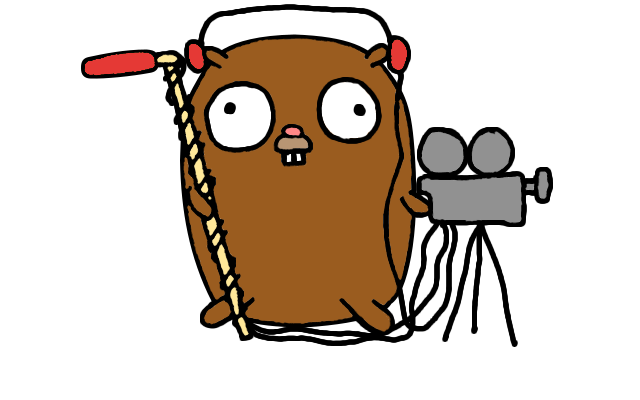

<h1 align="center">
  <a href="https://pion.ly"></a>
  <br>
  Offline Browser Sync
  <br>
</h1>
<h4 align="center">WebRTC without a signaling server!</h4>
<p align="center">
  <a href="https://pion.ly"></a>
  <a href="https://pion.ly/slack"></a>
  <br>
  <a href="LICENSE"></a>
</p>
<br>

This repo demonstrates how you can connect two WebRTC proccesses without signaling. No configuration is needed ahead of time, so no hardcoding of IP Addresses.
The peers use mDNS to connect to each other, and have pre-set ICE Credentials and DTLS Certificates.

### Running
* `git clone https://github.com/pion/offline-browser-communication.git`
* `cd offline-browser-communication`
* `go run *.go`
* Open https://jsfiddle.net/vksy1ujd/4/

You should see the following in your terminal.
```
Ready to connect, please load https://jsfiddle.net/vksy1ujd/4/
Connection State has changed checking
Connection State has changed connected
DataChannel foo has opened
```

If everything worked you can now send messages from your browser to your terminal!

### What this means
This means you can have two devices connect without any setup. No need to setup a server, or native apps with more control.

You could build stuff like.
* Sync data between two PWA without a backend
* Have a multiplayer game that never leaves your network
* Build a conferencing/chat app that doesn't require any setup
* *Please share your cool ideas with us!*

### FAQ
* Is this secure?
No currently everything is hardcoded, this is just a demonstration. I believe this could be reasonably secure if seeded properly. Better to ask a security person though.

* What platforms are supported?
OSX and Linux

* What browsers work?
Only Chromium so far. If there is interest I would like to support more

* What is next?
I would like to get this into the IETF/W3C, but as an individual I am unable to be involved. If you are interested and have membership please reach out!

* I want to talk about cool WebRTC stuff!
Join the [Pion Slack](https://pion.ly/slack)


### Community
Pion has an active community on the [Golang Slack](https://invite.slack.golangbridge.org/). Sign up and join the **#pion** channel for discussions and support. You can also use [Pion mailing list](https://groups.google.com/forum/#!forum/pion).

We are always looking to support **your projects**. Please reach out if you have something to build!

If you need commercial support or don't want to use public methods you can contact us at [team@pion.ly](mailto:team@pion.ly)

### License
MIT License - see [LICENSE](LICENSE) for full text
